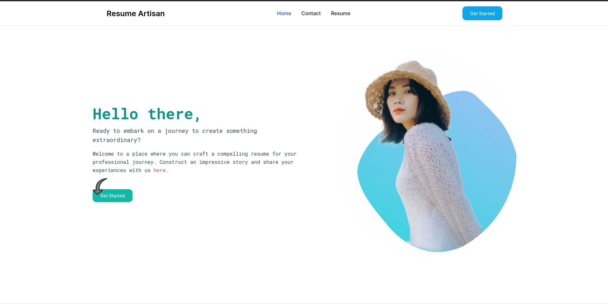

# Resume Artisan

Welcome to Resume Artisan, the ultimate resume builder for everyone.



## Getting Started

Follow these instructions to set up the project locally.

### Prerequisites

Ensure you have the following installed:

- Node.js

- npm or yarn

### Installation

1. Clone the repository:

```bash

git clone https://github.com/your-username/resume-artisan.git

```

2. Navigate to the project directory:

```bash

cd resume-artisan

```

3. Install dependencies:

```bash
npm install
#or
yarn install
#or
pnpm install
```

4. Running the development Server
   Start the development server with the following command:

```bash
npm run dev
# or
yarn dev
# or
pnpm dev
```

Open [http://localhost:3000](http://localhost:3000) with your browser to see the result.

## Features

- Build resumes with ease using our intuitive interface.
- Add multiple sections including user details, education, experience, skills, projects, and hobbies.
- Dynamic form fields to accommodate various information.
- Real-time preview of your resume as you build it.

## Project Structure

- `components/`: Contains reusable React components.
- `pages/`: Contains the main pages for the application.
- `styles/`: Contains styling files for the project.

## How to contribute

We welcome contributions! Here are a few ways you can help:

- **Report bugs**: If you find a bug, please report it.
- **Fix issues**: Check out the open issues and submit pull requests.
- **Add features**: You can also contribute by adding new features.

## Deployment

To deploy this project, you can use any static site hosting service.

## License

This project is licensed under the MIT license.
